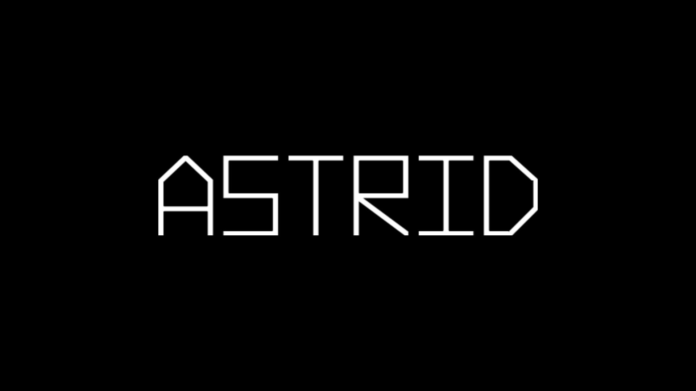

# Astrid
Jogo 2D baseado em asteroides com uso do mouse

## Capturas de Tela



## Como Jogar

- **Movimento:** Através do mouse você poderá controlar a direção que a nave irá atirar.
- **Objetivo:** Sobreviva o máximo de tempo sem ser atingido por um míssil.

## Requisitos

Certifique-se de que seu sistema atenda aos seguintes requisitos antes de compilar e executar o jogo:

- [OpenGL](https://www.opengl.org/) instalado
- Compilador C++ (ex: g++)
- [CMake](https://cmake.org/) instalado

## Compilação com CMake

Siga estas etapas para compilar o jogo usando o CMake:

1. **Clonar o repositório:**

   ```bash
   git clone https://github.com/FelpLiet/Astrid.git
   cd Astrid

2. **Configurar o projeto com CMake:**

    ```
    cmake ..

<!-- 3. **Configurar o projeto com CMake:**

    ```
    make    -->

## creditos

| [Felipe Nogueira](https://github.com/FelpLiet) | [Joao Victor](https://github.com/JVictor011) | [Pedro henrique](https://github.com/ph3523) |
| ----------- | ----------- | --  |
| |   | |
